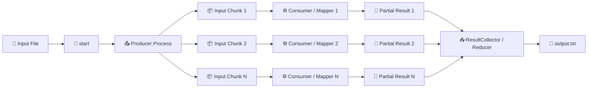
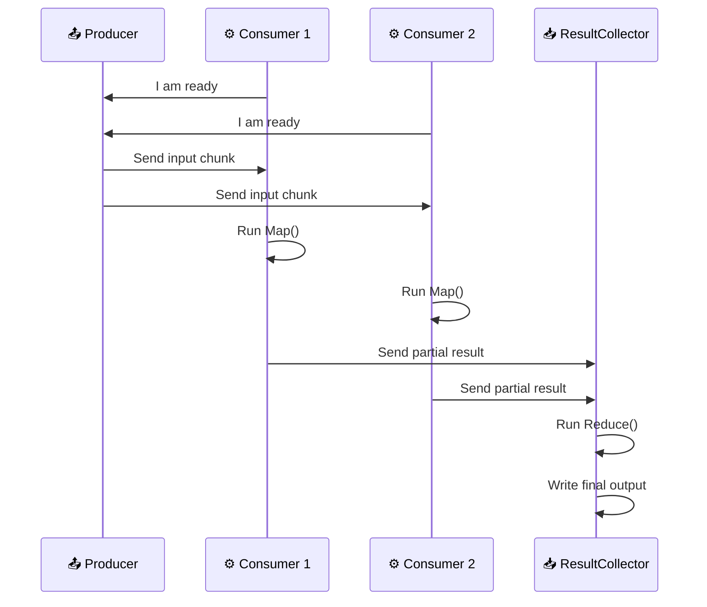
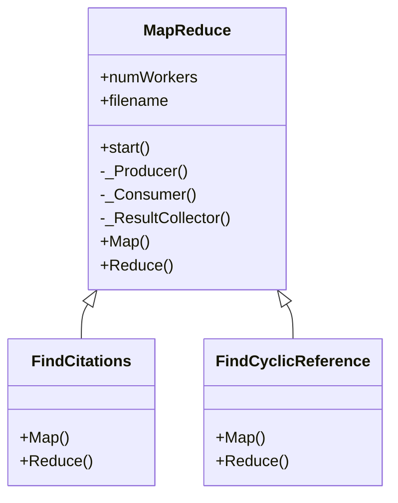
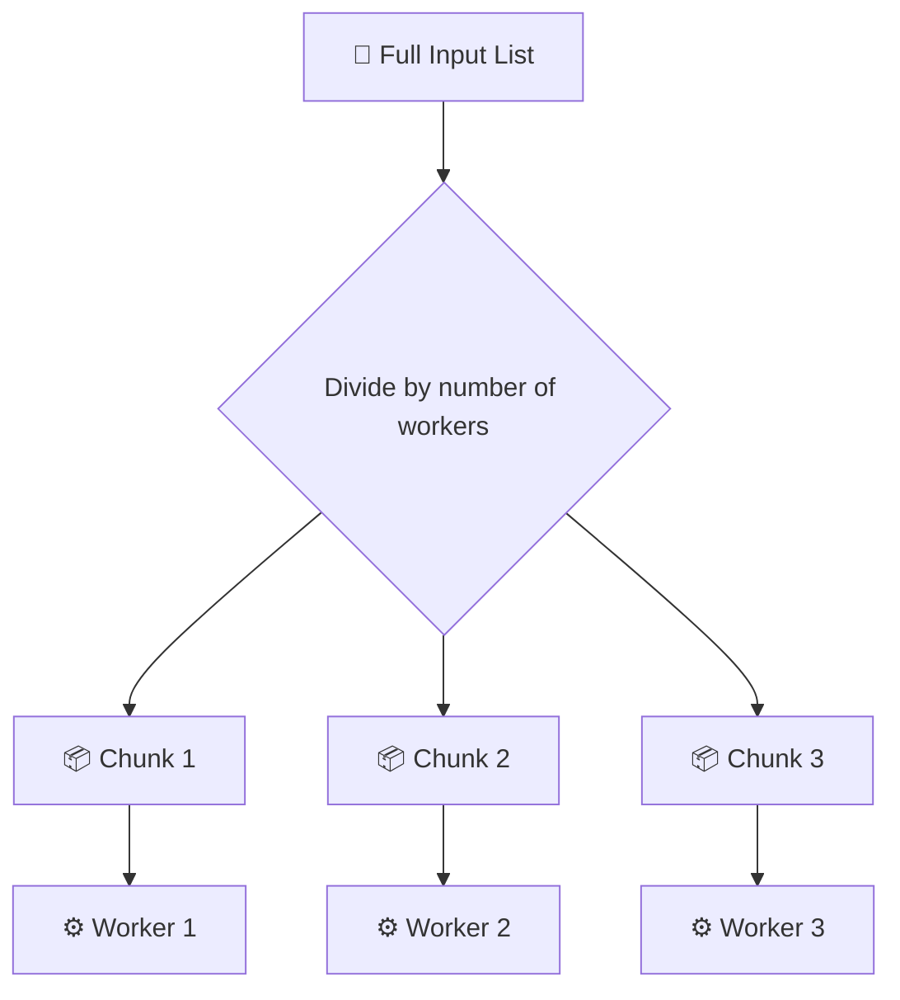
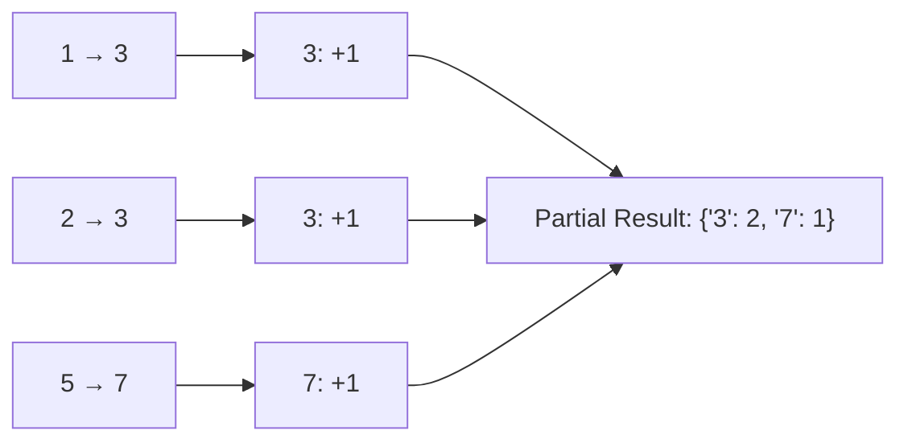
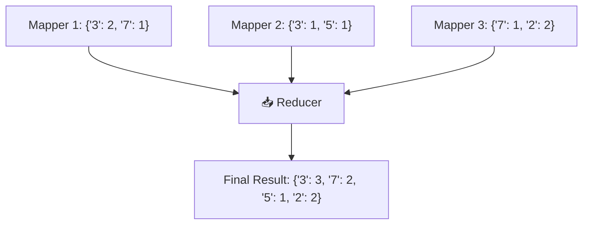
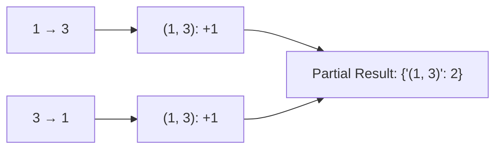
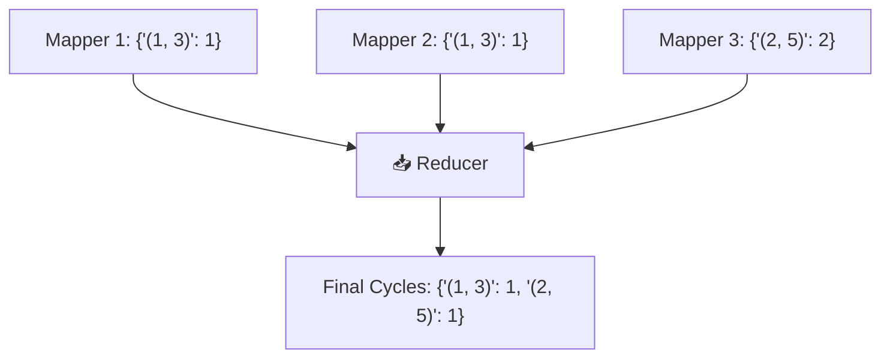

# 🧩 Distributed MapReduce Framework Citation Analysis with ZeroMQ


A Python implementation of a simplified **MapReduce programming framework**.

The project uses **ZeroMQ PUSH/PULL sockets** and Python **multiprocessing** to distribute input data across multiple worker processes, process citation graph records in parallel, and combine the partial results through a reducer.

The framework supports two citation graph operations:

- 📊 **COUNT**: Counts how many times each paper is cited.
- 🔁 **CYCLE**: Detects 2-node cyclic references where two papers cite each other.

---

## 📌  Overview

The goal of this project was to implement a simplified version of the **MapReduce programming model** using Python.

The framework is designed around three main roles:

1. 📤 **Producer**  
   Reads the input file, partitions the data, and distributes chunks to workers.

2. ⚙️ **Consumers / Mappers**  
   Process assigned input chunks and generate intermediate results.

3. 📥 **ResultCollector / Reducer**  
   Collects all mapper outputs, merges them, and writes the final result to a file.

The input dataset represents a citation graph. Each line contains a directed citation edge:

```text
citing_paper_id    cited_paper_id
```

For example:

```text
1    3
```

means that paper `1` cites paper `3`.

---

## 🛠️ Technologies Used

| Technology | Purpose |
|---|---|
| 🐍 Python 3 | Main programming language |
| 🔌 ZeroMQ / pyzmq | Inter-process socket communication |
| ⚙️ multiprocessing | Running producer, workers, and reducer as separate processes |
| 🧱 Abstract Base Classes | Creating a reusable MapReduce framework |
| 📄 Text Files | Input dataset and output result storage |

---

## 📁 Project Structure

```text
./
├── main.py                    # Command-line entry point
├── MapReduce.py               # Abstract MapReduce framework
├── FindCitations.py           # COUNT operation implementation
├── FindCyclicReference.py     # CYCLE operation implementation
├── test_generator.py          # Helper script for generating smaller test files
├── test01.txt                 # Sample input for citation counting
├── test02.txt                 # Sample input for cyclic reference detection
```

---

## 🧠 High-Level Architecture

The project follows a simplified MapReduce pipeline.



---

## 🔌 ZeroMQ Communication Flow

ZeroMQ is used to connect the producer, consumers, and result collector.



---

## 🧩 Framework Design

The core reusable framework is implemented in:

```text
MapReduce.py
```

The `MapReduce` class defines the common execution structure and requires subclasses to implement only the problem-specific logic:

```python
def Map(self, map_input):
    pass


def Reduce(self, reduce_input):
    pass
```

This design separates the **distributed execution logic** from the **actual computation logic**.

---

## 🧱 Class Relationship



---

## ⚙️ Main Components

| Component | File | Responsibility |
|---|---|---|
| 🧩 `MapReduce` | `MapReduce.py` | Abstract framework that manages processes, sockets, mapping, and reducing |
| 📤 `_Producer()` | `MapReduce.py` | Reads the input file, partitions data, and sends chunks to workers |
| ⚙️ `_Consumer()` | `MapReduce.py` | Receives one input chunk, applies `Map()`, and sends partial results |
| 📥 `_ResultCollector()` | `MapReduce.py` | Receives mapper outputs, applies `Reduce()`, and writes final output |
| 📊 `FindCitations` | `FindCitations.py` | Implements citation-counting logic |
| 🔁 `FindCyclicReference` | `FindCyclicReference.py` | Implements 2-node cycle detection |
| 🚀 `main.py` | `main.py` | Parses command-line arguments and starts the selected operation |

---

## 📡 Socket Design

The framework uses three ZeroMQ communication channels.

### 1. Worker Readiness Channel

```text
Consumer PUSH  --->  Producer PULL
```

Used so that each worker can tell the producer it is ready before input data is sent.

```text
Port: 5559
```

This prevents the producer from sending data before all workers have connected.

---

### 2. Work Distribution Channel

```text
Producer PUSH  --->  Consumer PULL
```

Used to send input partitions from the producer to the mapper workers.

```text
Port: 5560
```

Each consumer receives one chunk of the input dataset.

---

### 3. Result Collection Channel

```text
Consumer PUSH  --->  ResultCollector PULL
```

Used to send each mapper's partial result to the reducer.

```text
Port: 5561
```

The result collector waits until it receives results from all workers.

---

## 🧮 Data Partitioning Design

The producer divides the input list into nearly equal parts using:

```python
k, m = divmod(len(lineList), self.numWorkers)
```

This ensures that the input is distributed as evenly as possible.

For example, if there are `10` input lines and `3` workers:

```text
Worker 1 -> 4 lines
Worker 2 -> 3 lines
Worker 3 -> 3 lines
```

This helps balance the workload between mapper processes.



---

## 📊 Operation 1: COUNT - Citation Counting

The `COUNT` operation finds how many times each paper is cited.

Implemented in:

```text
FindCitations.py
```

---

### COUNT Map Phase

Each mapper receives citation edges such as:

```text
1    3
2    3
5    7
```

For each line:

```text
A    B
```

paper `A` cites paper `B`.

Therefore, the mapper increments the count for paper `B`.



Example mapper output:

```python
{
    "3": 2,
    "7": 1
}
```

---

### COUNT Reduce Phase

The reducer merges all mapper dictionaries by summing counts for the same paper ID.



---

## 🔁 Operation 2: CYCLE - Cyclic Reference Detection

The `CYCLE` operation detects 2-node cyclic references.

Implemented in:

```text
FindCyclicReference.py
```

A 2-node citation cycle exists when:

```text
A cites B
B cites A
```

For example:

```text
1    3
3    1
```

means paper `1` and paper `3` cite each other.

---

### CYCLE Map Phase

The mapper normalizes each citation edge into a shared pair key.

For example:

```text
1 → 3
3 → 1
```

both become:

```python
"(1, 3)"
```

This makes it easier for the reducer to detect whether both directions exist.



---

### CYCLE Reduce Phase

The reducer combines pair counts from all workers.

If a normalized pair appears more than once, the implementation treats it as a cyclic reference.



---

## 🚀 How to Run

Install the required dependency:

```bash
pip install pyzmq
```

Run the program with:

```bash
python main.py <OPERATION> <NUMBER_OF_WORKERS> <INPUT_FILE>
```

---

## 📊 Run Citation Counting

```bash
python main.py COUNT 4 test01.txt
```

Example output:

```python
{'3': 4, '1': 1, '2': 2, '7': 2, '5': 1}
```

---

## 🔁 Run Cyclic Reference Detection

```bash
python main.py CYCLE 3 test02.txt
```

Example output:

```python
{'(1, 3)': 1, '(2, 5)': 1, '(1, 5)': 1}
```

---

## 🧾 Command-Line Arguments

| Argument | Example | Description |
|---|---|---|
| `OPERATION` | `COUNT` | Operation type. Can be `COUNT` or `CYCLE` |
| `NUMBER_OF_WORKERS` | `4` | Number of mapper worker processes |
| `INPUT_FILE` | `test01.txt` | Input citation graph file |

Example:

```bash
python main.py COUNT 4 test01.txt
```

---

## 📄 Output File

The final result is written to:

```text
results.txt
```
---

## 🧪 Sample Test Files

| File | Purpose |
|---|---|
| `test01.txt` | Small input file for citation counting |
| `test02.txt` | Small input file for cyclic reference detection |

---

## 🧬 Dataset Notes

The project is based on the **High-Energy Physics Citation Network** dataset.

Each line in the dataset represents a citation relation:

```text
from_paper_id    to_paper_id
```

For easier testing, the project includes `test_generator.py`, which can create smaller random test files from the larger citation dataset.

Example generated file:

```text
test_file500.txt
```

This is useful because running the full dataset may take longer during development and testing.

---

## 🧪 Test File Generator

The project includes a helper script named `test_generator.py`, which can be used to create smaller random test files from the full citation dataset.

This is useful because the original `Cit-HepPh.txt` dataset is larger than the small sample files, so generating a smaller subset makes testing faster and easier during development.

### 📌 Purpose

`test_generator.py` randomly selects a fixed number of lines from the full citation dataset and writes them into a smaller test file.

For example, instead of running the MapReduce program on the entire dataset, you can generate a smaller file such as:

```text
test_file500.txt
```

and then run the `COUNT` or `CYCLE` operation on that generated file.

---

### 📁 Required Input File

The script expects the full dataset file to be available in the project folder:

```text
Cit-HepPh.txt
```

Expected structure:

```text
./
├── Cit-HepPh.txt
├── test_generator.py
├── main.py
└── ...
```

---

### 🚀 How to Use

Run the generator script with Python:

```bash
python test_generator.py
```

After running the script, it creates a smaller randomly sampled test file.

Example output file:

```text
test_file500.txt
```

---

### ▶️ Running MapReduce on the Generated File

After generating the smaller test file, you can use it as input for the MapReduce program.

Run citation counting:

```bash
python main.py COUNT 4 test_file500.txt
```

Run cyclic reference detection:

```bash
python main.py CYCLE 4 test_file500.txt
```

---

### 🛠️ Customizing the Generated File Size

Inside `test_generator.py`, the number of sampled lines can be changed by editing the sample size value.

For example, if the script samples `500` lines, the generated file may be named:

```text
test_file500.txt
```

To test with a larger or smaller input, update the sample size in the script and run it again.

---

### ✅ Why This Script Is Useful

- Allows quick testing without processing the full dataset.
- Helps verify the framework with different input sizes.
- Makes debugging easier by using smaller files.
- Demonstrates a simple testing workflow.

## 🎯 Design Choices

### 🧩 Reusable Abstract Framework

The `MapReduce` class contains the common distributed execution logic. This avoids repeating process-management and socket-communication code in every operation.

The subclasses only focus on the computation:

- `FindCitations` focuses on counting citations.
- `FindCyclicReference` focuses on detecting 2-node cycles.
---

### ⚙️ Parallel Mapper Workers

The number of workers is passed from the command line. This makes the framework flexible because the same program can be run with different levels of parallelism.

Example:

```bash
python main.py COUNT 2 test01.txt
python main.py COUNT 4 test01.txt
python main.py COUNT 8 test01.txt
```

---

### 🔌 ZeroMQ PUSH/PULL Pattern

The project uses ZeroMQ's `PUSH` and `PULL` sockets because they fit naturally with the MapReduce workflow:

```text
Producer pushes work.
Consumers pull work.
Consumers push results.
Reducer pulls results.
```

This provides a simple message-passing model between separate Python processes.

---

### 📦 Dictionary-Based Intermediate Results

Mapper outputs are represented as dictionaries.

For `COUNT`:

```python
{
    paper_id: citation_count
}
```

For `CYCLE`:

```python
{
    normalized_pair: pair_count
}
```

Dictionaries make reduction simple because values with matching keys can be combined efficiently.

---

### 📥 Single Reducer

The implementation uses one reducer process. This keeps the framework easier to understand and matches the project's simplified MapReduce model.

A more advanced version could support multiple reducers and partition intermediate keys between them.

---

## ✅ Key Learning Outcomes

This project demonstrates:

- 🧠 How the MapReduce programming model works.
- 🔌 How ZeroMQ can be used for inter-process communication.
- ⚙️ How Python multiprocessing can simulate distributed workers.
- 🧩 How abstract classes can define reusable framework behavior.
- 📊 How graph-processing problems can be solved using MapReduce.
- 🔁 How citation relationships can be analyzed for counting and cycle detection.

---


---

## 🚀 Possible Improvements

- Rename `output.txt` to `results.txt` to match the assignment specification.
- Add command-line validation for missing or invalid arguments.
- Make socket ports configurable instead of hardcoded.
- Add support for multiple reducers.
---

## 📌 Summary

This project implements a simplified MapReduce framework using Python, ZeroMQ, and multiprocessing.

The framework separates distributed execution from problem-specific logic, allowing multiple MapReduce-style applications to reuse the same infrastructure. The included `COUNT` and `CYCLE` operations demonstrate how citation graph problems can be solved using mapper and reducer functions.

Overall, the project provides hands-on experience with:

- Distributed computation concepts
- Message passing
- Worker coordination
- MapReduce design
- Graph data processing
